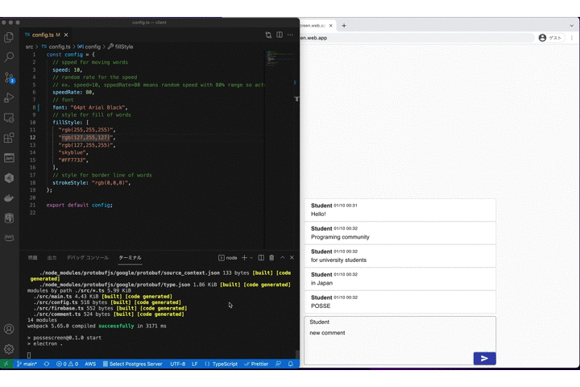

# POSSEscreen

POSSEscreen is for displaying and flowing subtitles on your screens like Niconico Movie.

## Available features

- Multi display
- A slack channel as a client
- Random color for messages
- Random speed for messages
- Changing fonts for messages

## Setup

1. Prepare a Firebase environment.
1. Create a Firestore database.
1. Deploy POSSEscreen web pages to the Firebase Hosting.
1. Build POSSEscreen client using Electron.
1. Start POSSEscreen client.
1. Access POSSEscreen web pages and send messages as an audience.

[Detailed instruction for the setup is here.](./docs/SETUP.md)

## Known issues

- POSSEscreen still doesn't have a security functions such as Authentication and Authorization.
- POSSEscreen still doesn't have a test code.
- POSSEscreen is still using both npm and yarn.

## How to contribute to POSSEscreen

1. Create issue for this repository ( https://github.com/yaggytter/POSSEscreen/issues )
1. Fork it ( https://github.com/yaggytter/POSSEscreen/fork )
1. Create your feature branch for the issue (git checkout -b new-feature)
1. Commit your changes (git commit -am 'Add some feature')
1. Push to the branch (git push origin new-feature)
1. Create a new Pull Request to develop branch
