# Setup POSSEscreen

## Prepare a Firebase environment

- Access to [the Firebase console](https://console.firebase.google.com/).
- Create and setup new Firebase project like following screens.

  - Click "Add project"
    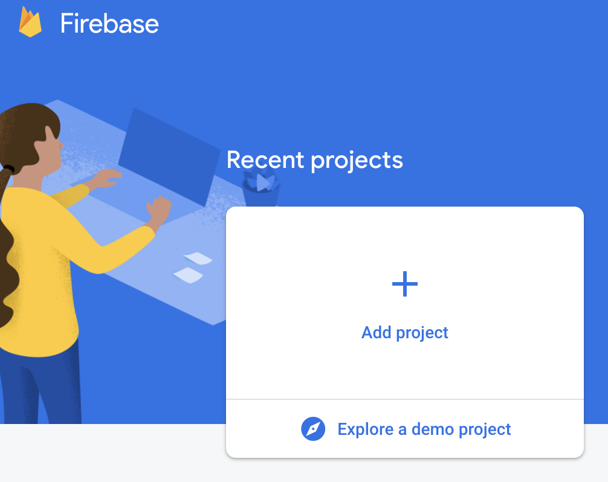

  - Name your project name and click Continue
    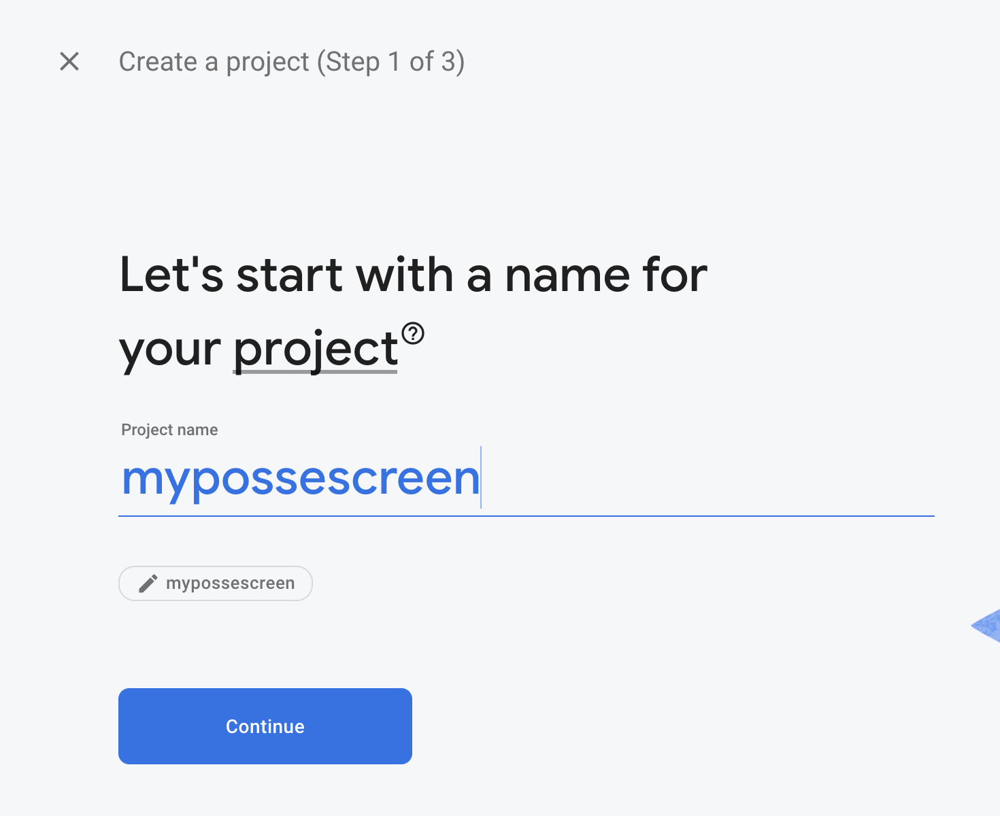

  - Turn off "Enable Google Analytics for this project" and Click Create project
    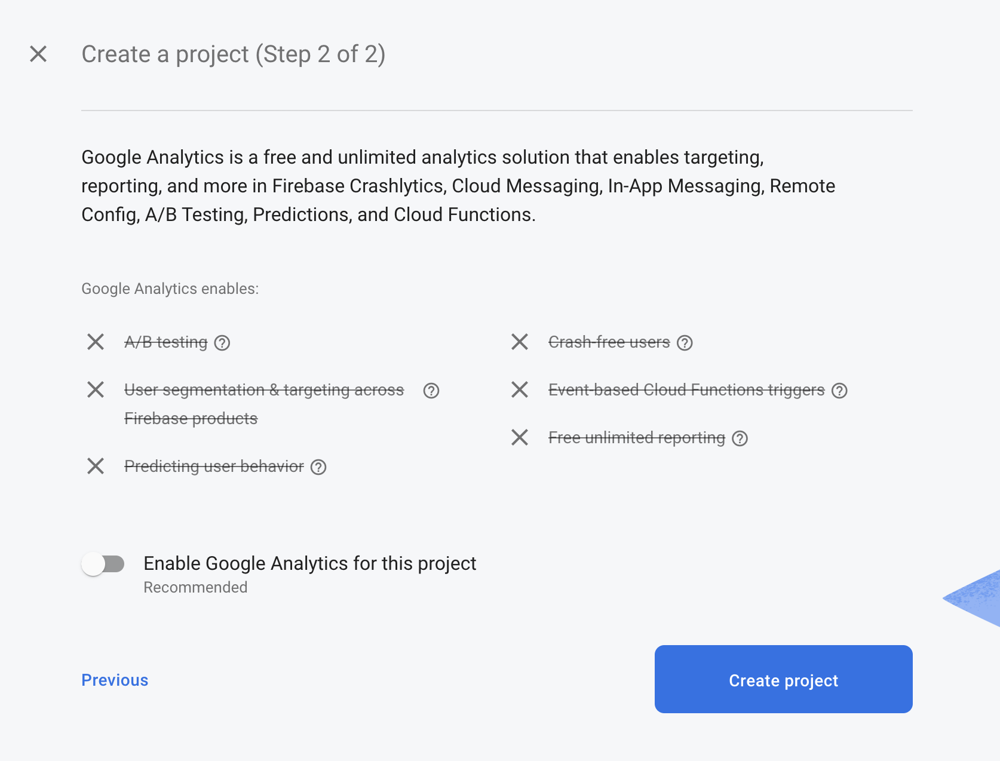

  - Click Continue
    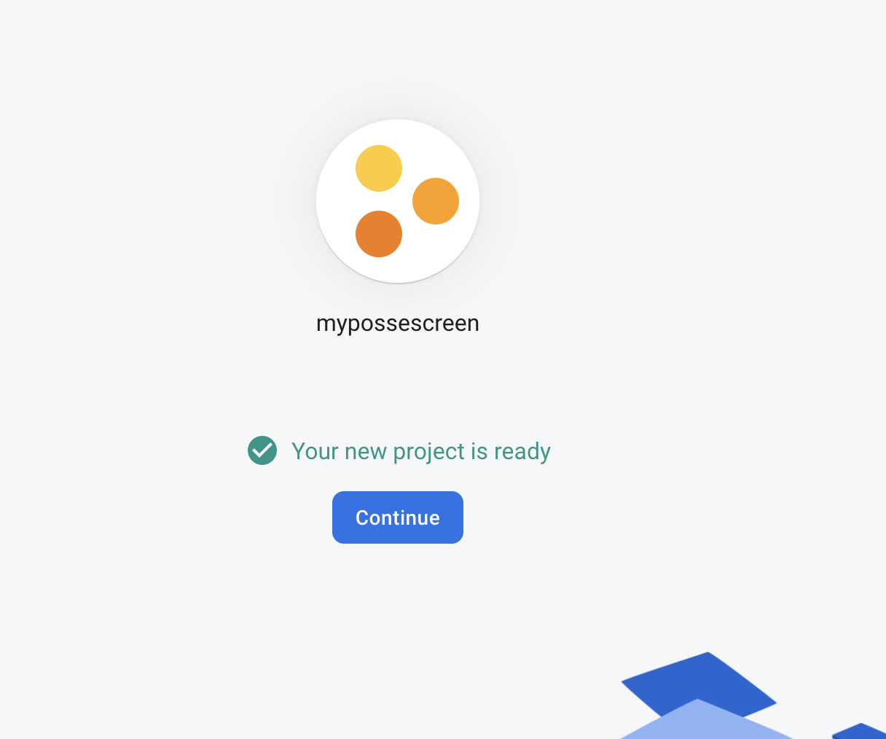

  - Click Firestore database
    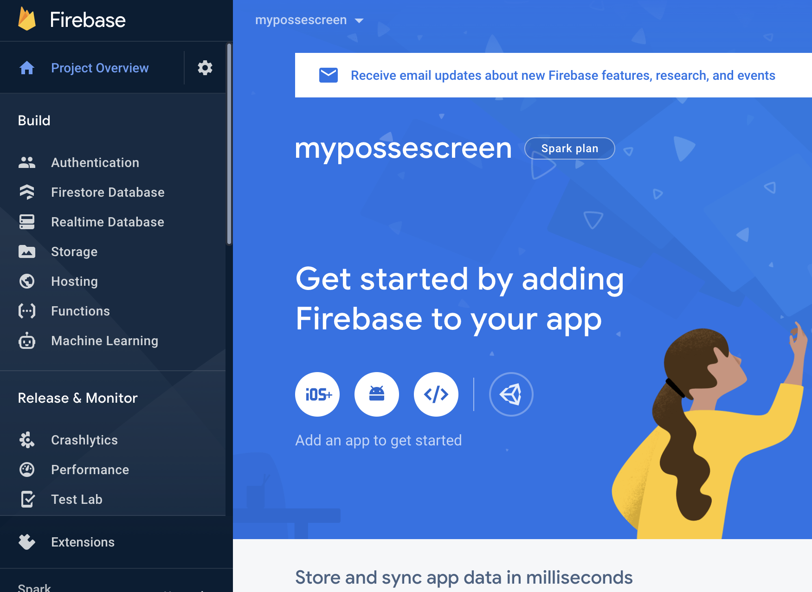

  - Click Create database
    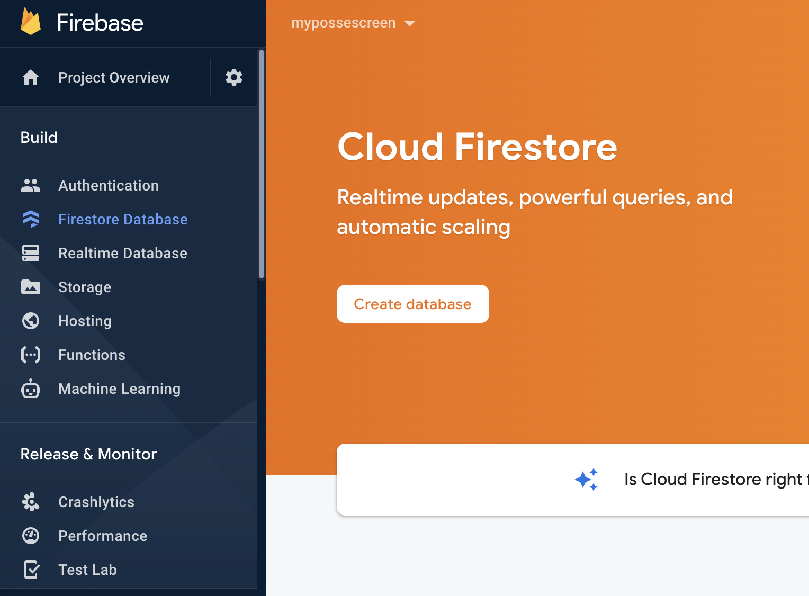

  - Click "Start in test mode" and click Next
    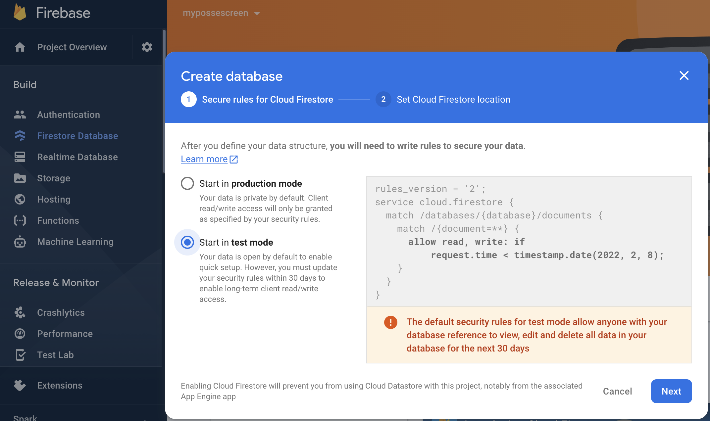

  - Select a location that is close to your area and click Enable
    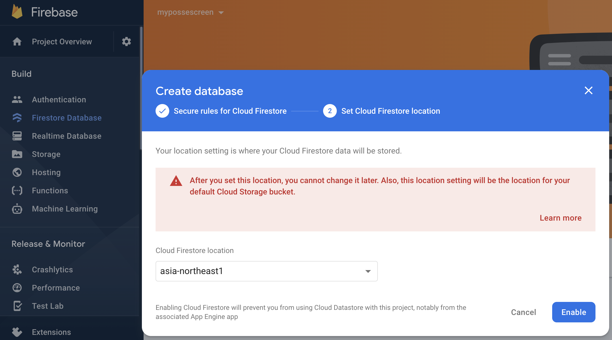

  - Click Project Overview
    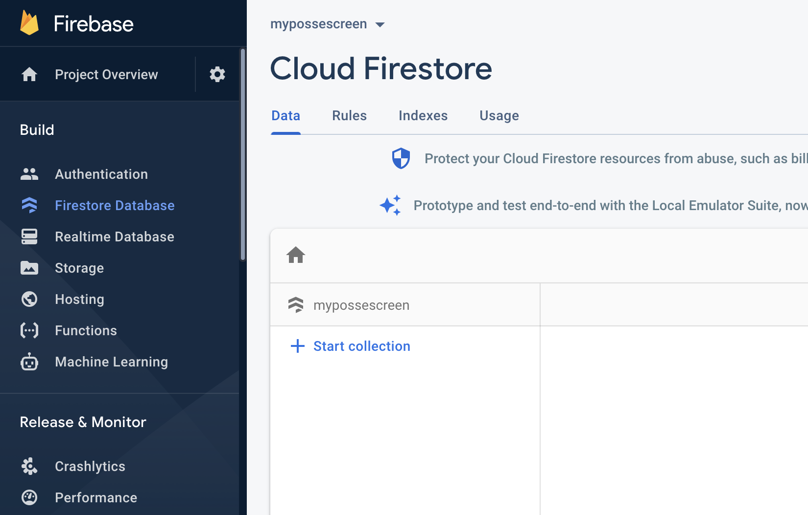

  - Click "Web" icon which is like "</>"
    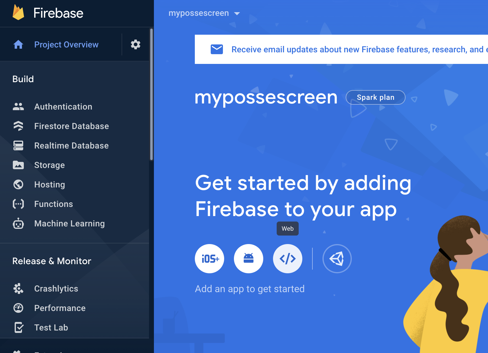

  - Name your App nick name, Click Firebase hosting check box to enable it and Click Register app
    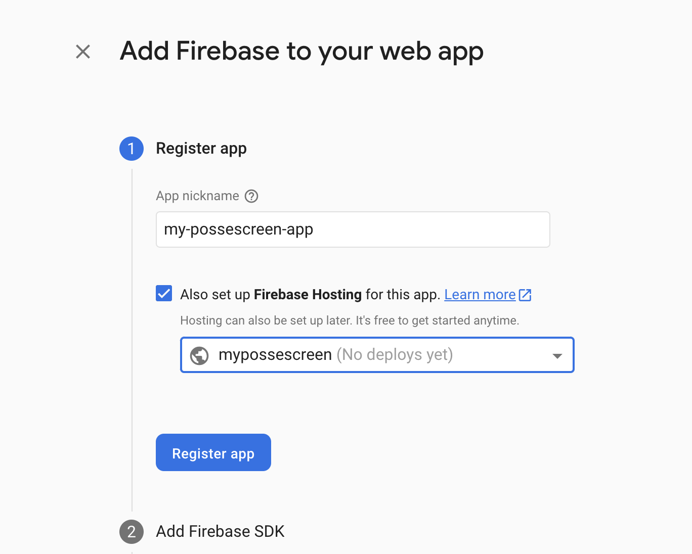

  - Copy your firebaseConfig variable code and paste it to [client/src/firebase.ts](../client/src/firebase.ts) and [webfront/lib/firebase.ts](../webfront/lib/firebase.ts) in this repository
    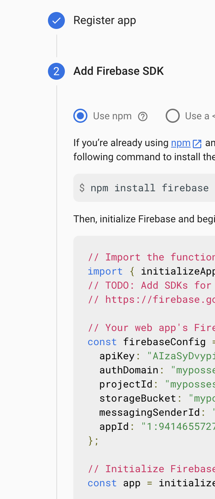

  - Click Next
    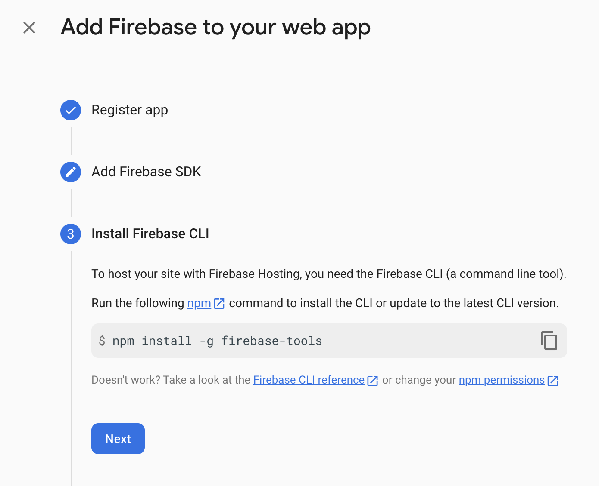

  - Click Continue to console
    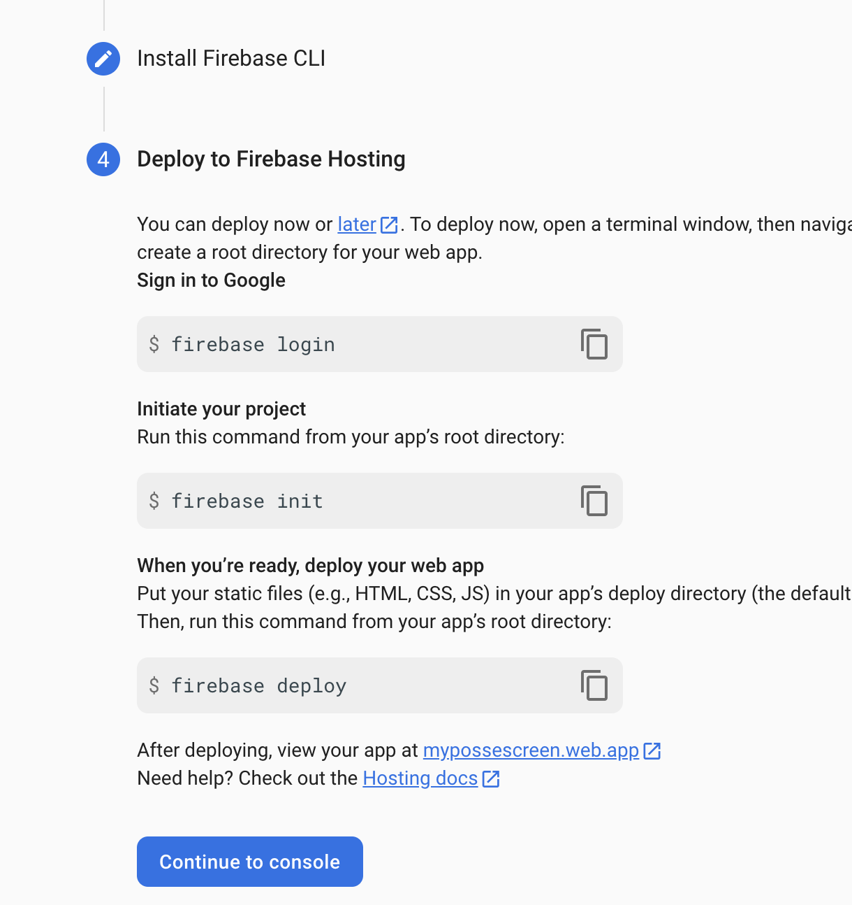

## Build and publish the Web Front Application

"Web Front Application" means a web application for chatting with Firestore.

- Move to Web Front directory.

```
cd webfront
```

- Install necessary packages.

```
yarn install
```

- Build the web application as a static web page.

```
yarn build
```

- Deploy the web application to Firebase hosting.

You can see project ids for Firebase projects to execute a following command.

```
firebase login
firebase projects:list
```

You have to replace `PROJECTID` in a following command to your exact project name which is configured by the previous procedure.

```
firebase use PROJECTID
firebase deploy
```

- You can see the web application on https://PROJECTID.web.app

You have to replace `PROJECTID` in the URL to your exact project name which is configured by the previous procedure.

## Build and use POSSEscreen the Client.

"Client" means the client application that show comments which is in chat using "Web Front Application" on your screens.

- Edit [config.ts](../client/src/config.ts)

- Move to Client directory.

```
cd ../client
or
cd client
```

- Install necessary packages.

```
npm install
```

- Build and execute the client.

```
npm run build
npm start
```

- You can send comments using Web Front Application to show the comment to your screen.

## Distribute a Client package for Windows, MacOS or Linux

If you want to distribute the Client package, You can use [electron-packager](https://github.com/electron/electron-packager) to create the package.

For example, If you want to create the package for MacOS with M1 Processer, execute a following command in client directory.

```
npx electron-packager . POSSEscreen --platform=darwin --arch=arm64
```

It will create the package in `POSSEscreen-darwin-arm64` directory.
